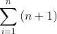

# Horner's low

## はじめに
連続関数はテーラー展開できるので多項式を数値計算することは大事です．  
ということでこの数値計算をしていきます．

## 多項式の捉え方

n項多項式  
  
を数値計算します．この式を単純に計算していくと回の掛け算とn回の足し算を計算することになります．  
一方，この式は以下のように変形できます．  
  
多項式をこのように捉えれば，各カッコは足し算と掛け算が一回ずつになり，合計でn回の掛け算とn回の足し算をすればいいのでメモリに優しいです．

これを実装しました．
